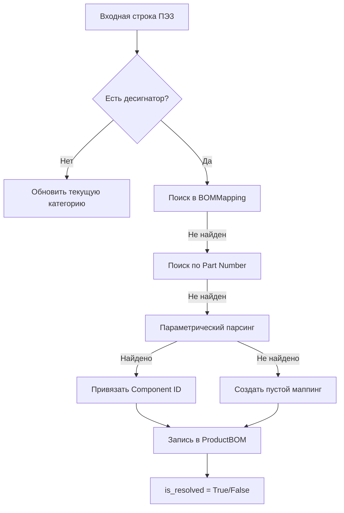

# BOM Matching Engine: Система интеллектуального сопоставления ресурсов

## 1. Обзор
`BOMMatchingService` — это центральный логический компонент системы, отвечающий за преобразование текстовых данных из конструкторских файлов (ПЭ3) в структурированные связи внутри базы данных. 

Сервис автоматизирует процесс наполнения состава изделия (Bill of Materials), минимизируя ручной труд закупщика и технолога.

## 2. Архитектура поиска (Cascading Search)
Сервис реализует «каскадную» модель поиска, переходя от самого точного метода к наиболее вероятностному:

1.  **Уровень A: Память маппинга (`BOMMapping`)**
    * *Механизм:* Поиск по истории ручных сопоставлений.
    * *Цель:* Если закупщик один раз подтвердил, что «Текст Х» — это «Деталь Y», система запомнит это навсегда.
2.  **Уровень B: Прямой поиск артикула (`Part Number`)**
    * *Механизм:* Поиск точного совпадения текста строки с полем `part_number` в справочнике ТМЦ.
    * *Цель:* Мгновенная привязка деталей, указанных по международным стандартам производителя.
3.  **Уровень C: Параметрический анализ (`BOM Parser`)**
    * *Механизм:* Использование `parse_with_context` для извлечения физических свойств (номинал, корпус, напряжение).
    * *Цель:* Поиск функциональных аналогов на складе при отсутствии прямого совпадения по тексту.

## 3. Обработка контекста документа
Сервис является **stateful** (сохраняет состояние) в процессе обработки файла. 
* При обнаружении строк-заголовков (например, «Резисторы», «Конденсаторы») сервис обновляет переменную `current_category`.
* Этот контекст передается в парсер для исключения неоднозначностей (например, чтобы отличить 10 вольт стабилитрона от 10 микрофарад конденсатора).

## 4. Алгоритм работы (Workflow)

## 5. Статусы сопоставления
Каждая позиция в созданном составе изделия получает флаг is_resolved:

* is_resolved = True (Зеленый): Система уверена в выборе. Позиция готова к резервированию и производству.

* is_resolved = False (Красный): Система создала запись в BOMMapping и ждет вмешательства человека. Как только закупщик сделает ручную привязку, все будущие импорты этого компонента станут автоматическими.

## 6. Бизнес-логика и обучение
Главная ценность сервиса — самообучение.

1. При первом импорте нового изделия многие позиции будут "красными".

2. Закупщик связывает их с реальными компонентами склада.

3. При втором импорте (или импорте другого изделия с такими же деталями) система узнает их на Уровне А и выполнит работу мгновенно.

## 7. Технические особенности реализации
* Транзакционность: Все изменения (создание BOM и новых маппингов) фиксируются в БД одной транзакцией (db.commit()).

* Нормализация единиц: При параметрическом поиске (Уровень C) учитываются нормализованные значения value_numeric, что позволяет сравнивать "10k" и "10000 Ohm".

* Защита от дублей: Метод _ensure_mapping_exists проверяет наличие записи перед созданием, предотвращая замусоривание таблицы маппинга.